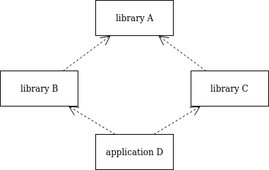

CMake diamond dependency resolution
-----------------------------------

This project only demonstrates one way to deal with diamond dependencies.

The Makefile in the root of this project is simply just to make "building" of the POC easier.

Just call `make` which will create a build directory and build everything.

Project structure:
--------------------

